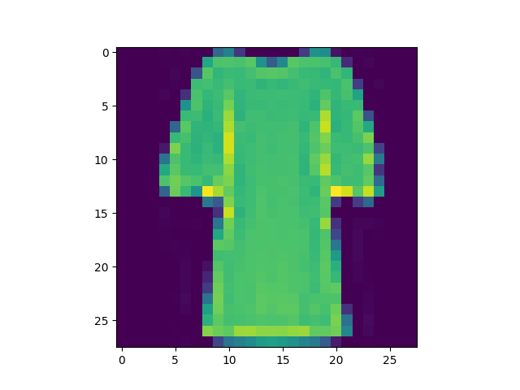
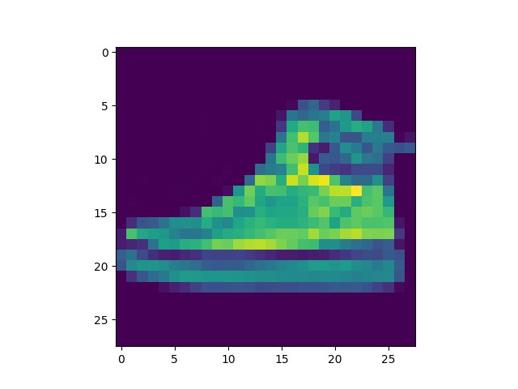

# Visualization of the internal state of a neural network based on dataset FashionMNIST
> sorry for my English

# Content
1. [Introduction](#intro)
2. [Information bottleneck](#ib)
3. [Hard negatives](#hn)
4. [Confusion matrix](#conf)

## 1. Introduction
Fashion-MNIST is a dataset of Zalando's article images—consisting of
a training set of 60,000 examples and a test set of 10,000 examples.
Each example is a 28x28 grayscale image, associated with a label from 10 classes. 

1. T-Shirt
2. Trousers
3. Pullover
4. Dress 
5. Coat 
6. Sandals 
7. Shirt 
8. Sneakers 
9. Bag 
10. AnkleBoots

## 2. Information bottleneck
There are 100 samples of 10 of each class.
The result was a short trajectory of the “movement” of the
prediction of each of their samples.

## 3. Hard negatives
There are 5 samples of each class with the maximum softmax
confidence of the erroneous class.

| Correct class |                               Miss 0                               |                               Miss 1                               |                               Miss 2                               |                               Miss 3                               |                               Miss 4                               |
|:-------------:|:------------------------------------------------------------------:|:------------------------------------------------------------------:|:------------------------------------------------------------------:|:------------------------------------------------------------------:|:------------------------------------------------------------------:|
|    T-Shirt    |          Shirt         |          Shirt         |          Shirt         |             Bag            |             Bag            |
|   Trousers    |           Coat          |     Sneakers    |     Sneakers    |           Coat          |     Sneakers    |
|   Pullover    |           Coat          |  AnkleBoots |           Coat          |           Coat          |         Shirt         |
|     Dress     |              Bag             |              Bag             |            Coat            |           Shirt          |           Shirt          |
|     Coat      |           Dress           |           Dress           |           Shirt           |           Dress           |           Shirt           |
|    Sandals    |  AnkleBoots  |  AnkleBoots  |  AnkleBoots  |  AnkleBoots  |  AnkleBoots  |
|     Shirt     |        T-Shirt       |           Dress          |            Coat            |            Coat            |        T-Shirt       |
|   Sneakers    |  AnkleBoots |  AnkleBoots |  AnkleBoots |  AnkleBoots |  AnkleBoots |
|      Bag      |         Sandals        |            Dress           |         T-Shirt        |            Dress           |            Dress           |
|  AnkleBoots   |    Sneakers   |    Sneakers   |    Trousers   |    Sneakers   |    Sneakers   |

## 4. Confusion matrix

 

